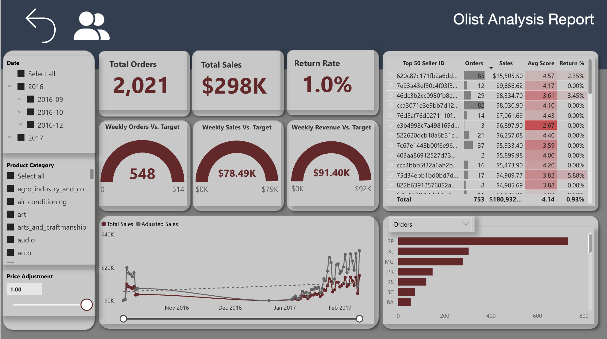

# Olist E-Commerce ETL on Azure Fabric

A comprehensive end-to-end data pipeline solution for processing Olist E-Commerce data using Microsoft Fabric, implementing a modern medallion architecture with real-time streaming, data quality validation, and business intelligence reporting.

## Project Architecture


The architecture follows a medallion data lakehouse pattern, processing CSV sales files through multiple refinement layers (Raw → Landing → Bronze → Silver → Gold) with event-driven triggers, Spark-based transformations, and Delta Lake storage.

## Sample Reports

### Dashboard Overview


### Customer Detail View


---

## Table of Contents

- [Overview](#overview)
- [Data Flow](#data-flow)
- [Technical Highlights](#technical-highlights)
- [Project Structure](#project-structure)
- [Key Components](#key-components)
- [Data Quality](#data-quality)
- [Getting Started](#getting-started)

---

## Overview

This project implements a production-ready ETL pipeline for Olist E-Commerce data on Microsoft Fabric, featuring:

- **Event-Driven Ingestion**: Automatic file processing when new data arrives
- **Medallion Architecture**: Bronze (raw), Silver (cleaned), Gold (enriched) layers
- **Streaming Processing**: Real-time data ingestion using Spark Structured Streaming
- **Data Quality Validation**: Great Expectations integration with automatic quarantine
- **Delta Lake**: ACID transactions and time travel capabilities
- **Business Intelligence**: Power BI semantic model and interactive dashboards

---

## Data Flow

### 1. **Raw → Landing** (Event-Driven Pipeline)

**Pipeline**: `Raw_To_Landing.DataPipeline`

- **Trigger**: File arrival detection in Azure Data Lake Storage Gen2 `raw` container
- **Process**:
  - Monitors `abfss://olist-project@dataprojectsforhuilu.dfs.core.windows.net/raw`
  - Processes files modified within the last 8 hours
  - Reads CSV files with proper schema inference
  - Adds `processing_date` partition column
  - Writes partitioned CSV to `landing` zone
  - Deletes source file after successful processing

**Notebook**: `01_Raw_To_landing.Notebook`
- Handles CSV parsing with multi-line support
- Adds processing metadata
- Implements partition-based storage

### 2. **Landing → Bronze** (Streaming Ingestion with Validation)

**Notebook**: `02_bronze.Notebook`

- **Streaming Sources**: Reads from `Files/landing/` directory
- **Tables Created**:
  - `customer_bz`, `geolocation_bz`, `product_bz`, `seller_bz`
  - `product_category_bz`, `order_bz`, `order_item_bz`
  - `payment_bz`, `review_bz`

- **Key Features**:
  - Spark Structured Streaming with `readStream`
  - Automatic schema enforcement
  - Metadata tracking (`load_time`, `source_file`)
  - Data quality validation via Great Expectations
  - Checkpoint-based fault tolerance
  - Quarantine table for failed records

- **Streaming Configuration**:
  - `maxFilesPerTrigger`: 10 files per batch
  - `availableNow` trigger mode for batch processing
  - Recursive file lookup enabled

### 3. **Bronze → Silver** (Upsert & Deduplication)

**Notebook**: `03_silver.Notebook`

- **Delta Streaming**: Reads from Bronze Delta tables using Change Data Feed
- **Tables Created**:
  - `order_sl`, `order_item_sl`, `payment_sl`, `review_sl`

- **Upsert Logic**:
  - MERGE operations using Delta Lake
  - Primary keys:
    - `order_sl`: `order_id`
    - `order_item_sl`: `order_id` + `order_item_id`
    - `payment_sl`: `order_id` + `payment_sequential`
    - `review_sl`: `order_id` + `review_id`
  - Watermark-based processing (30 seconds)
  - `update_time` timestamp tracking

- **Streaming Configuration**:
  - `startingVersion` for incremental processing
  - `ignoreDeletes` for append-only patterns
  - Update output mode

### 4. **Silver → Gold** (Analytics-Ready Enrichment)

**Notebook**: `04_gold.Notebook`

- **Business Logic Transformations**:
  - Date/time extraction from timestamps
  - Calculated metrics (e.g., `total_value = price + freight_value`)
  - Delivery duration calculations
  - Time-based aggregations

- **Tables Created**:
  - `order_gl`: Enhanced with `order_purchase_date`, `order_purchase_time`, `delivery_duration`
  - `order_item_gl`: Enhanced with `total_value`
  - `payment_gl`: Enhanced with date/time fields

- **Features**:
  - Business-friendly column names
  - Pre-aggregated metrics
  - Optimized for analytical queries

### 5. **Gold → Semantic Model → Power BI**

- **Semantic Model**: `olist_model.SemanticModel`
  - TMDL-based model definition
  - Relationships between tables
  - Measures and calculated columns
  - Date table integration

- **Power BI Report**: `olist_analysis_report.Report`
  - Interactive dashboards
  - Customer analytics
  - Sales performance metrics
  - State-level aggregations

---

## Technical Highlights

### 1. **Medallion Architecture Implementation**

```
Raw (CSV) → Landing (Partitioned CSV) → Bronze (Delta) → Silver (Delta) → Gold (Delta)
```

- **Bronze Layer**: Raw data with minimal transformation, schema enforcement, metadata tracking
- **Silver Layer**: Cleaned, deduplicated, conformed data with upsert capabilities
- **Gold Layer**: Business-ready, enriched data with calculated metrics

### 2. **Spark Structured Streaming**

- **Streaming Sources**:
  - File-based streaming from landing zone
  - Delta table streaming with Change Data Feed
  - Watermark-based late data handling

- **Streaming Sinks**:
  - Delta Lake tables with checkpoint management
  - Automatic schema evolution
  - Exactly-once semantics

### 3. **Delta Lake Features**

- **ACID Transactions**: Ensures data consistency
- **Time Travel**: Version history and rollback capabilities
- **Schema Evolution**: Automatic schema merging
- **Upsert Operations**: MERGE statements for deduplication
- **Change Data Feed**: Efficient incremental processing

### 4. **Data Quality Framework**

**Great Expectations Integration**:

- **Validation Rules**:
  - Not null constraints
  - Value range checks (e.g., `review_score` 1-5)
  - Value set validation (e.g., `order_status` enum)
  - String length validation (e.g., zip code format)
  - Numeric range validation (e.g., non-negative prices)

- **Quarantine Mechanism**:
  - Failed records stored in `data_quality_quarantine` table
  - Violation tracking with rule names
  - Raw data preservation in JSON format
  - Batch ID and ingestion timestamp

- **Validation Modes**:
  - Batch validation for initial loads
  - Streaming validation for real-time ingestion
  - Per-row error tracking

### 5. **Pipeline Orchestration**

**Data Pipelines**:

1. **Raw_To_Landing.DataPipeline**:
   - Event-driven file processing
   - Metadata-based filtering (8-hour window)
   - Sequential file processing
   - Automatic cleanup

2. **05_run_job.DataPipeline**:
   - Orchestrates Bronze → Silver → Gold processing
   - Parameterized execution
   - Sequential dependency management

### 6. **Environment Configuration**

- **Spark Compute**: Configurable via `Sparkcompute.yml`
- **Python Libraries**: Managed via `environment.yml`
  - `great_expectations==1.10.0`
- **Lakehouse**: Unified storage and compute

### 7. **Code Organization**

- **Helper Classes**:
  - `SetupBronzeHelper`: Bronze table creation and validation
  - `SetupSilverHelper`: Silver table setup
  - `SetupGoldHelper`: Gold table setup
  - `Bronze`: Streaming ingestion class
  - `Silver`: Upsert processing class
  - `Gold`: Enrichment processing class
  - `Upserter`: MERGE operation wrapper

- **Utility Functions**:
  - `preprocessing()`: Data cleaning (duplicates, nulls)
  - `validate_and_insert_single_dataframe()`: Batch validation
  - `validate_and_insert_process_batch()`: Streaming validation

---

## Project Structure

```
Azure_git/
├── adls/                          # Azure Data Lake Storage structure
│   └── olistfabric/
│       ├── landing/               # Landing zone (partitioned CSV)
│       └── medallion/
│           ├── bronze/            # Bronze layer (Delta)
│           ├── silver/            # Silver layer (Delta)
│           └── gold/              # Gold layer (Delta)
│       └── raw/                   # Raw zone (source CSV)
│
├── fabric_olist/
│   ├── notebooks/
│   │   ├── 00_initial.Notebook/   # Initial setup & table creation
│   │   ├── 01_Raw_To_landing.Notebook/  # Raw → Landing processing
│   │   ├── 02_bronze.Notebook/    # Landing → Bronze streaming
│   │   ├── 03_silver.Notebook/    # Bronze → Silver upsert
│   │   ├── 04_gold.Notebook/      # Silver → Gold enrichment
│   │   ├── 05_run_job.Notebook/   # Main orchestration notebook
│   │   ├── great_expectations_setting.Notebook/  # GX configuration
│   │   ├── great_expectations_processing.Notebook/  # Streaming validation
│   │   └── great_expectations_single_df.Notebook/  # Batch validation
│   │
│   ├── pipelines/
│   │   ├── Raw_To_Landing.DataPipeline/  # Event-driven ingestion
│   │   └── 05_run_job.DataPipeline/      # ETL orchestration
│   │
│   ├── olist_LH.Lakehouse/        # Lakehouse metadata
│   ├── olist_model.SemanticModel/ # Power BI semantic model
│   ├── olist_analysis_report.Report/  # Power BI report
│   └── olist_dev.Environment/     # Environment configuration
│
└── report/
    ├── olist_analysis_report.pbix # Power BI desktop file
    └── sample/                    # Sample report screenshots
```

---

## Key Components

### Initial Setup (`00_initial.Notebook`)

- Creates all Delta tables for Bronze, Silver, and Gold layers
- Defines schemas with proper data types
- Sets up data quality quarantine table
- Validates table creation
- Includes cleanup utilities

### Data Quality Validation

**Great Expectations Configuration**:
- Suite-based validation rules per table
- JSON-based rule persistence
- Thread-safe validation for streaming
- Ephemeral context for isolation

**Validation Examples**:
- Customer: Required `customer_id`, zip code length validation
- Order: Status enum validation, timestamp requirements
- Payment: Non-negative values, payment type validation
- Product: Dimension constraints, weight/height validations

### Streaming Processing

**Bronze Layer**:
- File-based streaming with schema enforcement
- Metadata extraction (`_metadata.file_path`)
- Automatic checkpoint management
- Parallel stream processing with scheduler pools

**Silver/Gold Layers**:
- Delta streaming with version tracking
- Watermark-based processing
- MERGE operations for upserts
- Update time tracking

---

## Data Quality

### Quarantine Table Schema

```sql
CREATE TABLE data_quality_quarantine (
    table_name STRING,
    batch_id LONG,
    violated_rules STRING,
    raw_data STRING,
    ingestion_time TIMESTAMP
)
```

### Validation Flow

1. **Batch Validation** (Initial Load):
   - Single DataFrame validation
   - Row-level error tracking
   - Immediate quarantine or insertion

2. **Streaming Validation** (Real-time):
   - Micro-batch processing
   - Thread-safe validation
   - Concurrent stream handling
   - Error aggregation per batch

### Quality Metrics Tracked

- Duplicate detection
- Null value handling
- Schema compliance
- Business rule validation
- Data type correctness

---

## Getting Started

### Prerequisites

- Microsoft Fabric workspace
- Azure Data Lake Storage Gen2 account
- Olist E-Commerce dataset (CSV files)

### Setup Steps

1. **Initial Setup**:
   ```python
   # Run 00_initial.Notebook
   setupBronzeHelper.setup()
   setupSilverHelper.setup()
   setupGoldHelper.setup()
   ```

2. **Configure Data Quality**:
   ```python
   # Run great_expectations_setting.Notebook
   # Define validation rules per table
   ```

3. **Deploy Pipelines**:
   - Configure `Raw_To_Landing.DataPipeline` with ADLS connection
   - Set up file trigger conditions
   - Deploy `05_run_job.DataPipeline` for ETL orchestration

4. **Load Initial Data**:
   - Upload CSV files to `raw` container
   - Pipeline automatically processes to `landing`
   - Run `05_run_job.Notebook` to process through all layers

5. **Connect Power BI**:
   - Import semantic model
   - Refresh report with Gold layer data
   - Configure refresh schedule

### Configuration

**Environment Variables**:
- `account_name`: Azure Storage account name
- `container_name`: ADLS container name
- `lakehouse_name`: Fabric Lakehouse name

**Pipeline Parameters**:
- `file_name`: Source file name (Raw → Landing)
- `processing_date`: Partition date
- `Once`: Batch mode flag
- `ProcessingTime`: Streaming interval

---

## Technologies Used

- **Microsoft Fabric**: Unified analytics platform
- **Apache Spark**: Distributed data processing
- **Delta Lake**: ACID transactions and time travel
- **Great Expectations**: Data quality validation
- **Power BI**: Business intelligence and reporting
- **Azure Data Lake Storage Gen2**: Scalable data storage
- **PySpark**: Python API for Spark
- **Structured Streaming**: Real-time data processing

---

## Best Practices Implemented

1. **Separation of Concerns**: Clear layer boundaries (Bronze/Silver/Gold)
2. **Idempotency**: Upsert operations prevent duplicates
3. **Fault Tolerance**: Checkpoint-based recovery
4. **Data Lineage**: Metadata tracking (`source_file`, `load_time`)
5. **Quality Gates**: Validation before data promotion
6. **Scalability**: Partitioned storage and parallel processing
7. **Monitoring**: Quarantine table for quality issues
8. **Documentation**: Comprehensive code comments and structure

---

## License

This project is part of an educational ETL pipeline implementation on Azure Fabric.


